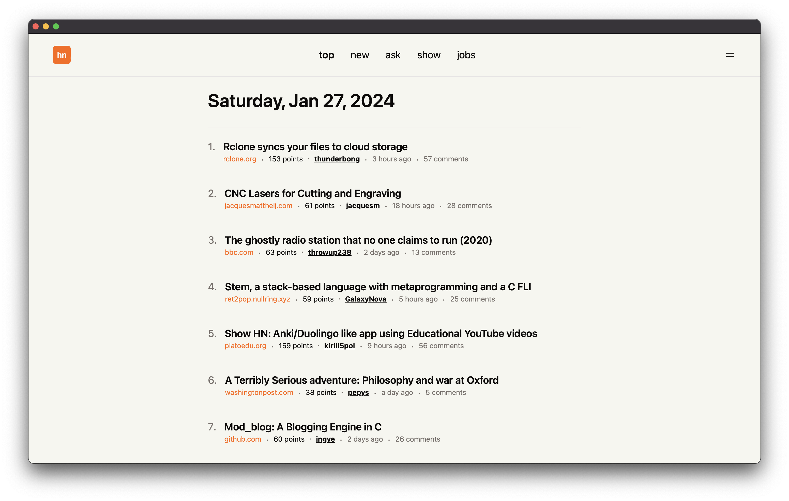
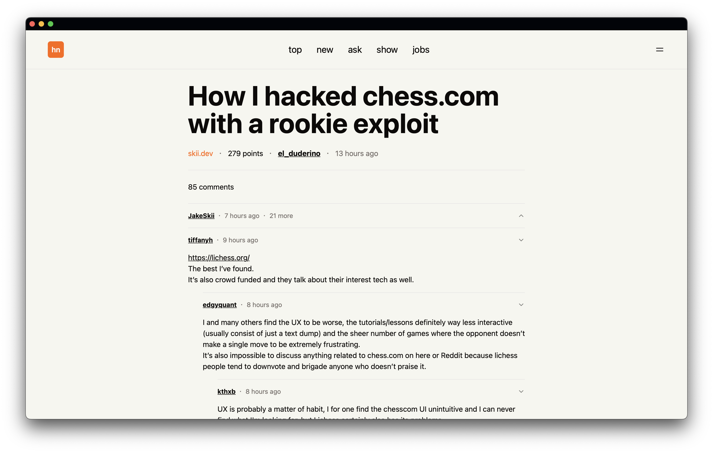

# hacker newsy

https://hn.cotyhamilton.com

a pretty hacker news client

## screenshots

## features

- feature toggles
- light and dark theme
- pagination or infinite scroll
- installable as a web app (pwa)
- serves cached content offline

## built with

- [sveltekit](https://kit.svelte.dev)
- [shadcn-svelte](https://www.shadcn-svelte.com)

## inspiration

- [modern for hacker news](https://www.modernhn.com)
- [hn.svelte.dev](https://hn.svelte.dev)
